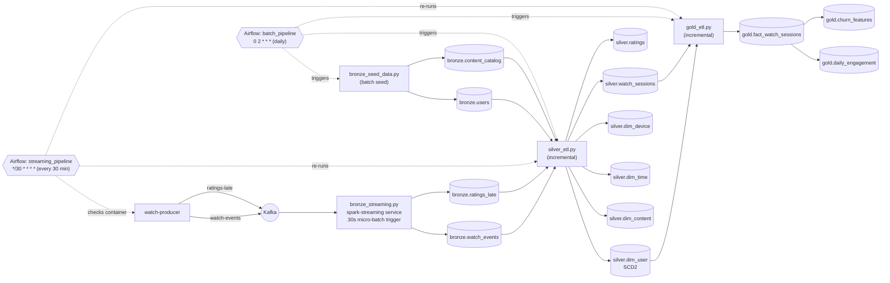

# Architecture Overview

## Data Flow

- **Real-time path**: `watch-producer` publishes to Kafka topics `watch-events` and `ratings-late`. `bronze_streaming.py` consumes both via Spark Structured Streaming (`foreachBatch`, 30-second trigger) and appends to `bronze.watch_events` / `bronze.ratings_late`. It runs as the `spark-streaming` service in `processing/docker-compose.yml` and starts automatically with `docker compose up`.
- **Batch seed path**: `bronze_seed_data.py` generates `bronze.users` and `bronze.content_catalog` directly (no Kafka involved).
- **Bronze → Silver** (`silver_etl.py`, incremental): runs null/duplicate checks on `bronze.users`, `bronze.content_catalog`, and `bronze.watch_events`. Writes `silver.dim_user` (SCD Type 2 — detects `subscription_tier`/`country` changes, expires the old row, inserts a new version), `silver.dim_content`, `silver.dim_time` (calendar attributes per distinct event date), `silver.dim_device` (device category lookup), `silver.watch_sessions` (only rows newer than the last run's max `ingestion_time`; `completion_percent` is computed from the actual content length via a join to `silver.dim_content`, falling back to a 60-minute assumption if the content isn't found), and `silver.ratings` (also incremental, tagged `is_within_48h`).
- **Silver → Gold** (`gold_etl.py`, incremental): `gold.fact_watch_sessions` only processes sessions newer than its last run and joins them to the current `silver.dim_user` rows for `user_key`. `gold.daily_engagement` and `gold.churn_features` are fully recalculated from `fact_watch_sessions` on every run.
- **Orchestration**: Airflow DAG `batch_pipeline` (`0 2 * * *`) runs `bronze_seed_data.py` → `silver_etl.py` → `gold_etl.py` → a `quality_gate` check, daily. DAG `streaming_pipeline` (`*/30 * * * *`) checks that the `watch-producer` container is running, then re-runs `silver_etl.py` and `gold_etl.py` to pick up newly streamed data.

## Layers

### Bronze Layer (Raw)
- `bronze.watch_events` — raw streaming watch events from Kafka
- `bronze.ratings_late` — late-arriving user ratings (up to 48h delay)
- `bronze.users` — user master data (batch)
- `bronze.content_catalog` — content catalog (batch)

### Silver Layer (Cleaned)
- `silver.dim_user` — SCD Type 2 user dimension
- `silver.dim_content` — content dimension
- `silver.dim_time` — time dimension
- `silver.dim_device` — device dimension
- `silver.watch_sessions` — cleaned watch events with late-arrival flag
- `silver.ratings` — validated ratings with 48h window flag

### Gold Layer (Aggregated)
- `gold.fact_watch_sessions` — fact table (star schema)
- `gold.daily_engagement` — daily KPI dashboard table (per date)
- `gold.churn_features` — ML feature table (per user per day)

## Data Quality Checks
- Null checks on all primary keys
- Duplicate checks on user_id and content_id
- Late-arriving data: flagged if event_time is 5min-48h before ingestion_time
- Schema validation on all bronze tables

## Components
- **MinIO**: S3-compatible storage at localhost:9001
- **Iceberg REST**: Table catalog at localhost:8181
- **Spark Master**: Processing at localhost:8080
- **Kafka**: Streaming at localhost:9092
- **Kafka UI**: Monitor at localhost:8090
- **Airflow**: Orchestration at localhost:8085
