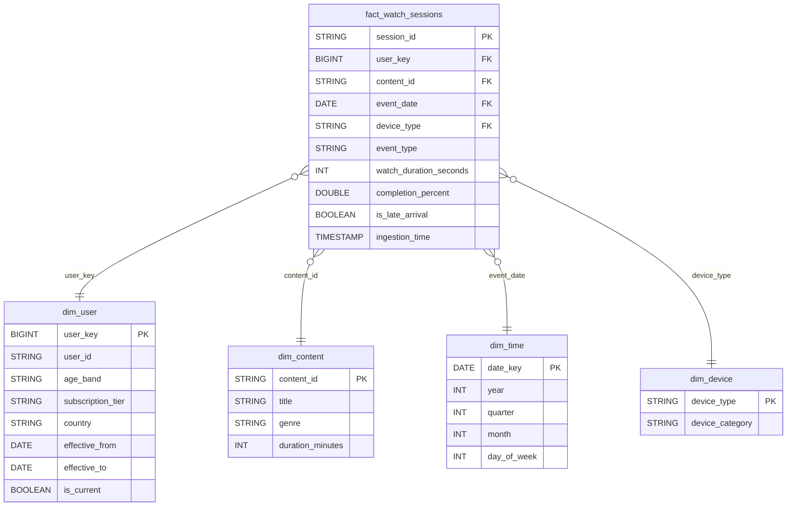

# Data Model

## Star Schema

## Gold Tables

### daily_engagement (per date)
Dashboard table for executives — aggregated by date, never cumulative.

### churn_features (per user per day)
ML feature table with high granularity: age_band, subscription_tier,
watch patterns, device preferences, late arrival counts.

## SCD Type 2
`dim_user` implements SCD Type 2:
- `effective_from` / `effective_to` date range
- `is_current = TRUE` for active record
- Historical records kept when subscription_tier or country changes
