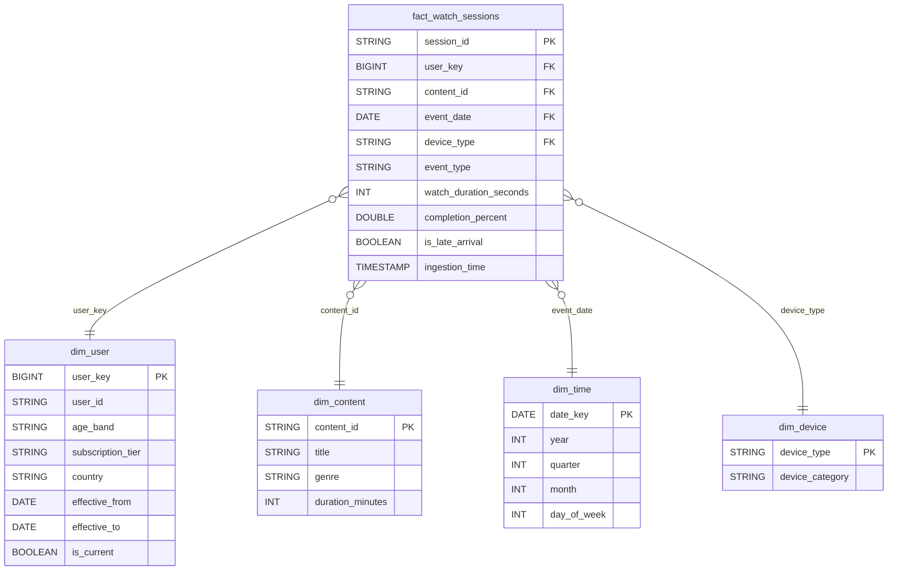

# Data Model

## Star Schema

## Gold Tables

### daily_engagement (per date)
Dashboard table for executives — aggregated by date, never cumulative.

| Field | Type | Description |
|---|---|---|
| date | DATE | Aggregation day (from `fact_watch_sessions.event_date`) |
| total_users | BIGINT | Distinct `user_id` count for the day |
| total_sessions | BIGINT | Count of sessions (rows) for the day |
| total_watch_hours | DOUBLE | `sum(watch_duration_seconds) / 3600`, rounded to 2 decimals |
| avg_watch_time_minutes | DOUBLE | `avg(watch_duration_seconds) / 60`, rounded to 2 decimals |
| avg_completion_rate | DOUBLE | `avg(completion_percent)`, rounded to 2 decimals |
| total_play_events | BIGINT | Count of events where `event_type = 'play'` |
| total_finish_events | BIGINT | Count of events where `event_type = 'finish'` |
| finish_rate | DOUBLE | `total_finish_events / total_sessions * 100`, rounded to 2 decimals |
| ingestion_time | TIMESTAMP | Write time of the Gold ETL run |

### churn_features (per user per day)
ML feature table with high granularity: age_band, subscription_tier,
watch patterns, device preferences, late arrival counts.

| Field | Type | Description |
|---|---|---|
| date | DATE | Aggregation day |
| user_id | STRING | User identifier |
| age_band | STRING | From `silver.dim_user` (bucketed: 18-24 / 25-34 / 35-44 / 45-54 / 55+) |
| subscription_tier | STRING | From `silver.dim_user` (current row) |
| country | STRING | From `silver.dim_user` (current row) |
| days_since_signup | INT | `datediff(date, dim_user.signup_date)` |
| sessions_count | BIGINT | Count of sessions for the user on that day |
| total_watch_hours | DOUBLE | `sum(watch_duration_seconds) / 3600` for that day, rounded to 3 decimals |
| watch_time_30d | DOUBLE | Rolling sum of `total_watch_hours` over the trailing 30 days (window function, `rangeBetween(-30d, 0)`, partitioned by user) |
| avg_completion_rate | DOUBLE | `avg(completion_percent)` for that day, rounded to 2 decimals |
| finish_rate | DOUBLE | `finish_count / sessions_count * 100`, rounded to 2 decimals |
| play_count | BIGINT | Count of `event_type = 'play'` that day |
| pause_count | BIGINT | Count of `event_type = 'pause'` that day |
| stop_count | BIGINT | Count of `event_type = 'stop'` that day |
| finish_count | BIGINT | Count of `event_type = 'finish'` that day |
| unique_content_watched | BIGINT | Distinct `content_id` count for the user that day |
| sessions_7d | BIGINT | Rolling sum of `sessions_count` over the trailing 7 days (window function, `rangeBetween(-7, 0)` on the date cast to epoch days) |
| watch_hours_7d | DOUBLE | Rolling sum of `total_watch_hours` over the trailing 7 days |
| favorite_genre | STRING | Genre with the most sessions for the user that day (`max_by(genre, count)`, joined via `silver.dim_content`) |
| preferred_device | STRING | Device with the most sessions for the user that day (`max_by(device_type, count)`) |
| late_arrival_count | BIGINT | Count of events where `is_late_arrival = true` |
| churn_label | INT | Rule-based churn flag: `1` if `finish_rate < 10`, or if `sessions_count <= 1` and `days_since_signup > 30`; otherwise `0` |
| ingestion_time | TIMESTAMP | Write time of the Gold ETL run |

## SCD Type 2
`dim_user` implements SCD Type 2:
- `effective_from` / `effective_to` date range
- `is_current = TRUE` for active record
- Historical records kept when subscription_tier or country changes
